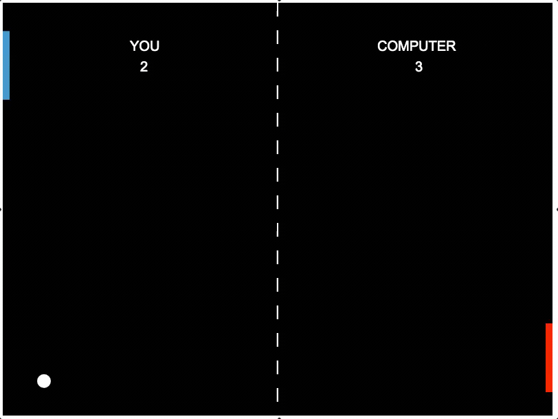

# Pong
Simple Ping Pong game written in JavaScipt on HTML5 canvas.

Play against the AI computer in a simple, yet classic game of Ping Pong!
 First player to 5 points wins!

What I learned:
- display, position, and move filled shapes for retro and prototype gameplay
- handle real-time mouse input
- write some basic artificial intelligence
- detect and respond to paddle and ball collisions

 
